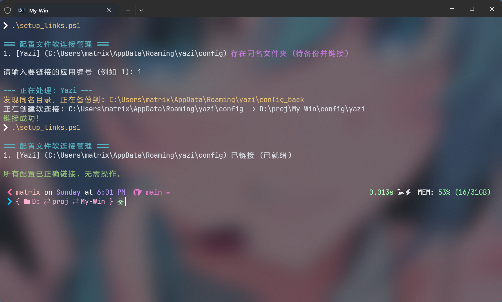

# My-Win

基于 Windows 的个人工作流配置集合，涵盖了平铺窗口管理、终端增强及美化。

## 🖼️ 预览 (Preview)


---

## 🛠️ 环境要求

- **OS**: Windows 11
- **Package Manager**: [Scoop](./scoop.md) (用于安装各类 CLI 依赖)
- **Font**: 建议安装 [Nerd Fonts](https://www.nerdfonts.com/) (如 JetBrainsMono Nerd Font) 以获得完整的图标支持。

---

## 📑 目录 (Table of Contents)

| 📚 类别 (Category) | ✨ 应用 (App) |
| :--- | :--- |
| **Package Manager** | **[Scoop](./scoop.md)** |
| **File Manager** | **[Yazi](./yazi.md)** |
| **Status Bar** | **[YASB](./yasb.md)** |
| **Window Manager** | **[GlazeWM](./yasb.md#3-glazewm)** |
| **Terminal** | Windows Terminal |
| **System Fetch** | Fastfetch |
| **Shell Prompt** | Oh My Posh |

---

## 🚀 快速开始

### 1. 克隆仓库
```powershell
git clone https://github.com/your-username/My-Win.git
cd My-Win
```

### 2. 设置符号链接 (Symbolic Links)
项目中包含 `setup_links.ps1` 脚本，用于将配置文件链接到系统对应的配置目录。

#### `setup_links.ps1` 使用方法：

1. **权限准备**：
   - 脚本创建软链接需要 **管理员权限**。请以管理员身份运行 PowerShell。
   - 或者在 Windows 设置中开启 **开发人员模式**。

2. **运行脚本**：
   ```powershell
   ./setup_links.ps1
   ```
   

3. **交互操作**：
   - 脚本会自动检测当前配置的链接状态：
     - **已链接**：配置已就绪。
     - **未链接**：尚未建立软链接。
     - **存在同名文件夹**：目标位置已有配置，脚本会提示进行备份（后缀加 `_back`）。
   - 根据提示输入应用对应的 **编号** 即可完成自动链接。

---
