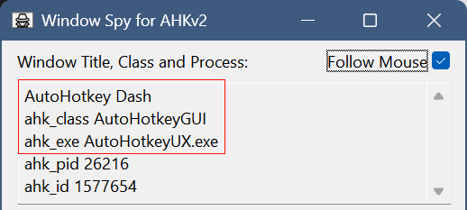

# YASB & GlazeWM 配置

## 1. 官方资源
- **YASB Repository**: [https://github.com/amnweb/yasb](https://github.com/amnweb/yasb)
- **YASB Wiki**: [https://github.com/amnweb/yasb/wiki](https://github.com/amnweb/yasb/wiki)
- **GlazeWM Repository**: [https://github.com/glzr-io/glazewm](https://github.com/glzr-io/glazewm)

---

## 2. YASB
### 安装
```powershell
# 添加 extras bucket (如果未添加)
scoop bucket add extras

# 安装 YASB
scoop install extras/yasb
```

### Cava 依赖 (音频频谱组件)
> **NOTE**: cava version >= 0.10.4

```powershell
# 使用 winget 安装
winget install cava

# 验证
cava -v
```

---

## 3. GlazeWM
### 安装
```powershell
# 安装 GlazeWM
scoop install extras/glazewm
```

### 窗口规则定制
使用 AutoHotkey 的 Windows Spy 获取 `window_process`, `window_class`, `window_title`。

#### 安装 AutoHotkey
```powershell
# 安装 AutoHotkey
scoop install autohotkey
```



---

## 4. 链接配置文件
使用项目根目录下的脚本建立符号链接（需管理员权限）。

```powershell
./setup_links.ps1
```
